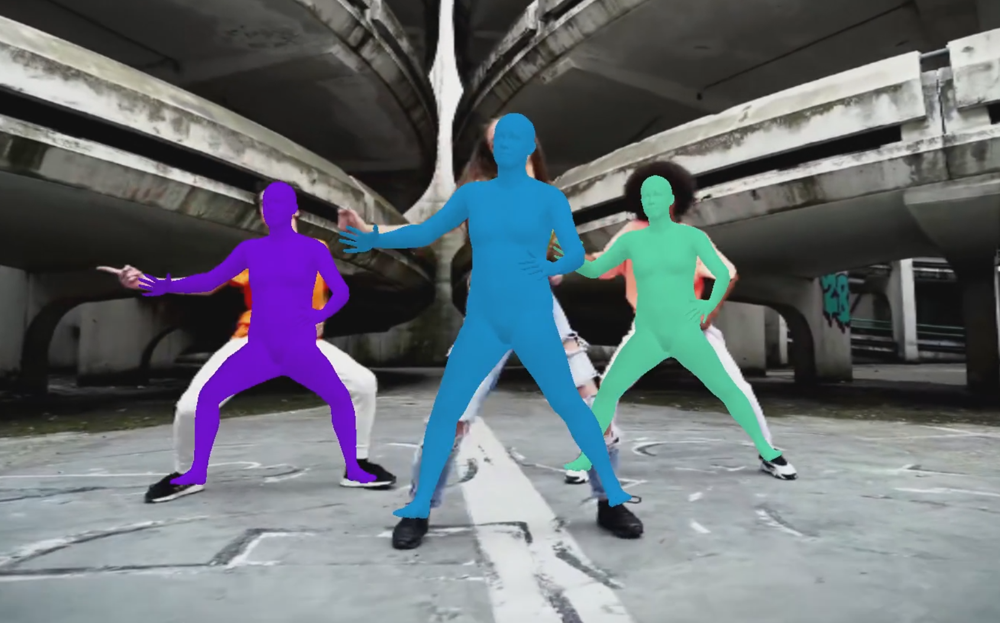

# Realtime 3D/2D Multi Pose Tracker

Support both ONNX and Tensorflow



## How to use

Install requirements (and tensorflow if needed.)

Modify Config.py to switch TF/ONNX.

```python
ONNXINFERENCE = True 
ONNXRENDERER = False #TF is much faster.
```

Default is to use both onnx and tensorflow.

```
python Run.py
```

### Switch 2D/3D

Modify Config.py
```
RENDER = True
```
ONNXRENDERER = True is much slower since many operations will fall back to CPU.

SMPL model is used for 3D rendering. The model is downloaded from here.
https://github.com/classner/up/blob/master/models/3D/basicModel_neutral_lbs_10_207_0_v1.0.0.pkl

(You can also use male/female models)
SMPL: https://smpl.is.tue.mpg.de/


## Bug

- Sometimes BG brightness will change in the renderer when a window is resized??

## TODO

- C++ version (prioritized)
- 2D to 3D part is mostly trained using dance videos with no ground truth data. We should use more suitable datasets.

## Environment

Tested with: 
- Windows 10
- Python 3.7

## Note

其实效果方面不是特别满意，不过业余做的时间有限。优先做C++版本等Deploy。图像》2D关键点 》3D关键点 这个Pipeline是靠运动轨迹推测3D姿势。有些数据上还是看得出来变换2D后有情报丢失。分离了两个阶段的原因是，跳舞/瑜伽之类的非常规姿态识别的bottleneck是在2D关键点检测（至少用Coco之类的常规数据集训练的话），有问题的情况一般是说3D之前2D检测已经失败了。分了两个阶段的话，更好的2D关键点模型出来的时候比较方便更新。这个看开发时间和效果之间的性价比。

トラッキングの精度に関しては実際完全に満足しているわけではありませんが、余暇の開発ですので時間は限られています。とりあえず使い物になる程度になったので、C++版等のデプロイを優先する予定です。画像＞２Dキーポイント＞３Dキーポイントというパイプラインを使っていますが、これは運動の軌跡を使用して3Dポーズを推定します。2Dキーポイントに変換の際にの情報が失われる状況は確かに存在します。 2つのステージを分離する理由は、ダンス/ヨガなどの特殊な姿勢認識のボトルネックが2Dキーポイント検出にあるためです（少なくともCocoなどのデータセットでは）。問題のある状況では大抵３D以前に２Dのキーポイント検出が間違っています。2つのステージに分割しておくと、更に精度の良い2Dキーポイントモデルが出てきたときに更新が簡単です。このあたりは開発時間と効果の兼ね合いになります。

